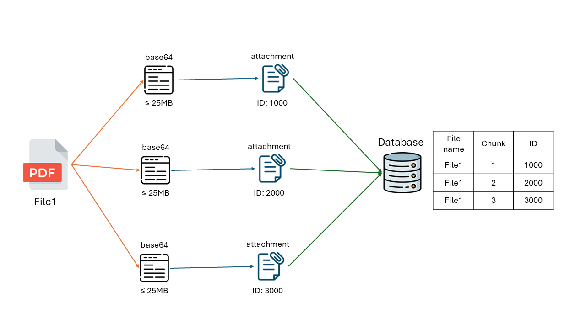

# Spacify - Unlimited Cloud (pre-release)

## 1. Overview

When you upload files to Google Drive or other cloud services, are you sick and weary of having limited storage? Have you ever wished there was a more effective way to manage large files without having to worry about running out of storage? There's nowhere else to look! `Spacify` lets users upload, download, and delete files with ease, which addresses these frequent problems. Curious about how big files are handled by it? Each file is divided into smaller chunks, which are then effectively stored by utilising Discord's storage. When the user needs any file, it combines those chunks into a single file and initiates the download. 

Are you prepared for enhanced file management? Now let's get going!

## 2. How it works?

- Each file you upload will be splited into chunks with maximum size of `25MB` each (which is the limitation of a file in channel). The chunk is a text file which contains `base64 encoded string` of the file.

- These chunks will be uploaded to a Discord channel as an `attachment` in a message. The `message id` and `channel id` will be stored in a database.

- When you want to download the file, the bot will fetch the chunks using `message id` from the Discord channel and combine them into a single file. Then, it will initiate the download.

    

    *The process of uploading a file. Download is a reversed process (which deletes all messages that contain file's chunks from Discord).*

## 3. Features

- Unlimited storage since the files are stored in Discord.
- Easy to use interface.
- Supported all file types.

## 4. Limitations

- Discord does not make it apparent whether a channel will be deleted for uploading excessive amounts of files, hence all stored files may be lost. As a result, it is recommended that you do not upload files that are too large or too many at once.

- Of course, the project is still in its early stages, so there may be bugs or issues that need to be resolved. If you encounter any, please report them to us so that we can address them as soon as possible.

## 5. Contributing

- Contributions are welcome! If you have any ideas for improvements or bug fixes, feel free to submit a pull request.

## 6. Demo

https://github.com/longtoZ/spacify/assets/67490989/5a61a75d-b890-418f-8d13-19d095366c9e

